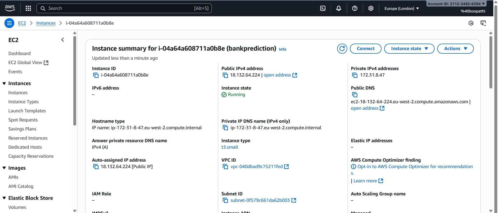
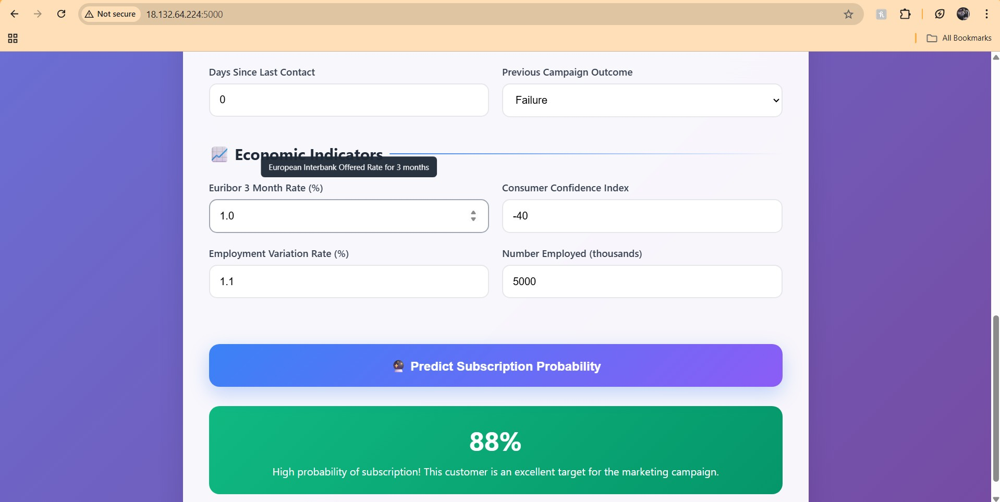
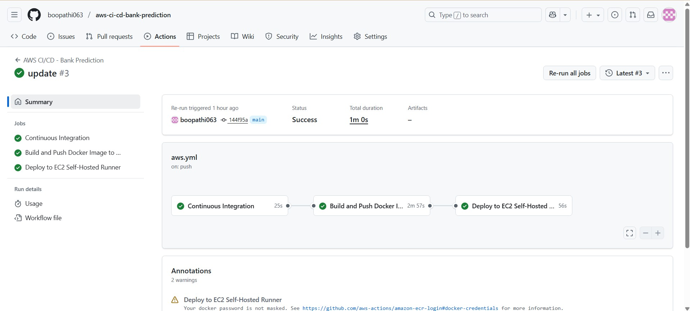

# Bank Marketing Prediction
**AI-Powered Customer Subscription Analysis**

  
  
  
  

  
  

---

## 🚀 Project Overview
This project is an **AI-powered web application** that predicts whether a bank customer will subscribe to a term deposit based on their demographics, past interactions, and economic indicators. The model leverages advanced **machine learning algorithms** like **XGBoost** for high accuracy, and the application is built using **Flask** for web deployment and **Docker** for containerization and cloud readiness.

---

## 📊 Features
- Predict customer subscription probability for a term deposit.
- Provides risk levels: **High** or **Low**.
- Generates actionable recommendations for marketing campaigns.
- Interactive **web interface** for real-time predictions.
- RESTful **API endpoint** for integration with other applications.
- Fully **Dockerized** for cloud deployment (AWS, GCP, Azure).
- Supports **feature engineering** and data validation for robust predictions.

---

## 🛠️ Tech Stack
- **Python 3.11**
- **Flask** – Web application framework
- **XGBoost & LightGBM** – Machine learning models
- **Pandas & NumPy** – Data manipulation
- **Seaborn & Matplotlib** – Visualization
- **Docker** – Containerization for deployment
- **AWS / Cloud Hosting** – Scalable deployment
- **Optuna** – Hyperparameter optimization

---

## 🤖 Models Evaluated  
The project benchmarks several machine learning models before selecting the best:  

- Logistic Regression  
- Decision Tree Classifier  
- Random Forest Classifier  
- Gradient Boosting Classifier  
- Support Vector Machine (SVM)  
- K-Nearest Neighbors (KNN)  
- XGBoost  
- LightGBM  

**Final Choice:**  
- **XGBoost** was selected as the production model, achieving:  

| Metric   | Score |
|----------|-------|
| Accuracy | 0.87  |
| Recall   | 0.93  |
| F1 Score | 0.62  |
| ROC-AUC  | 0.96  |

---

## 📂 Project Structure
├── app.py # Flask application
├── Dockerfile # Docker image setup
├── requirements.txt # Python dependencies
├── README.md # Project documentation
├── models/ # Saved trained models
│ ├── best_model.pkl
│ └── xgb_pipeline.pkl
├── data/ # Dataset files
│ ├── bank.csv
│ ├── processed_train.csv
│ └── processed_test.csv
├── src/
│ ├── init.py
│ └── utils.py # Prediction and feature engineering utilities
├── templates/ # HTML templates
│ ├── index.html
│
├── notebook/ # Jupyter notebooks for EDA & modeling
└── .github/workflows/ # CI/CD workflows 

## Run Locally with Docker

Pull the Docker image:

--bash
docker pull boopathi064/bankprediction-app:latest

## Project Screenshots

### AWS EC2 Instance

### Prediction

### CI/CD & Project Flow

